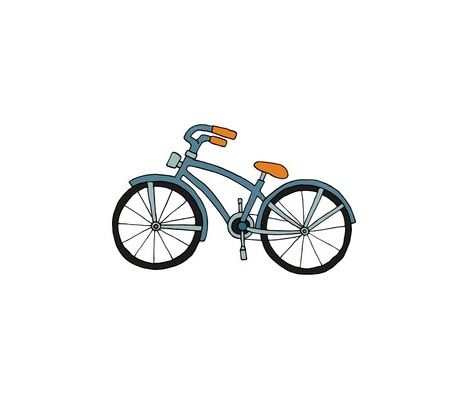

# Progetto Bike Sharing (Sweng 2020-2021)
Il progetto consiste nella realizzazione di un sistema di bike sharing. \
🦄 [Specifica e altri dettagli](https://ericcobeneins.ariel.ctu.unimi.it/v5/frm3/ThreadList.aspx?fc=btKwoa2oc6qdQ1iiqMKQ8LZhtkAeZ1qVnvtKiskufZmRIJfVIONzsS9zS0H9PVnO&roomid=202765)
## To-do list:

### Progettazione del sistema

- [x] Specifica
- [x] Dominio
- [x] Diagramma dei casi d'uso
- [x] Descrizione degli scenari
- [x] Diagramma delle classi
- [ ] Diagrammi di sequenza
- [ ] Diagrammi di attività
- [x] Macchine di stato
- [ ] Diagramma dei componenti

### Implementazione del sistema

- [x] Discussione dei design pattern utilizzati
- [x] Gestione dei dati persistenti
- [x] Descrizione dell'interfaccia grafica
- [ ] Diagramma di deployment
- [ ] Vincoli
- [x] Testing
- [x] Note di installazione e utilizzo: in corso
